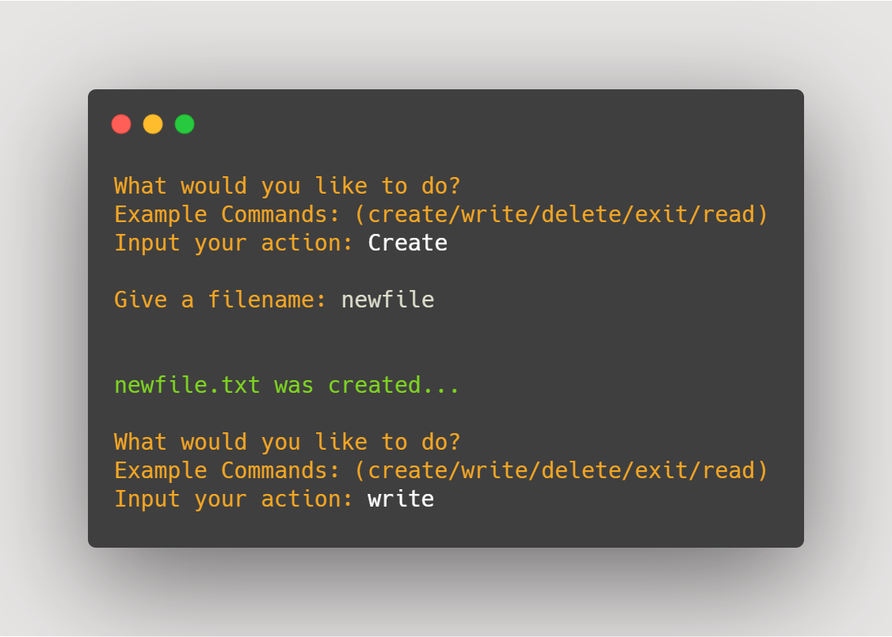

# Python CRUD (text file) CLI #
___
This CLI program is a CRUD based application. Not only can you create new, read from, write to and delete .txt files. But inside the parent directory, you can create folders, delete folders, read the contents from inside those folders. Also, the file (CRUD) functions take in a folder parameter which allows you do anything to any file inside any folder. 

## Getting Started ##
___
**Packages**

So far the only package that this application utilizes that will need to be installed is *colorama*. This allowed me to give some character to the application and make it a better experience for use.



>The command I used to install this will was:

```
pip install colorama
```
>You can find the package documentation here:

<a href='https://pypi.org/project/colorama/'>https://pypi.org/project/colorama/</a>

**Other packages Used**

- os
- datetime
- fileinput

---
## Built With ##
---
- Python 

### Authors ###
---
- Kris Montgomery
